# tutor

项目是一个简单的【家校互动平台】，角色包括：管理员、教师、学生、家长。

首先看一下数据库表。
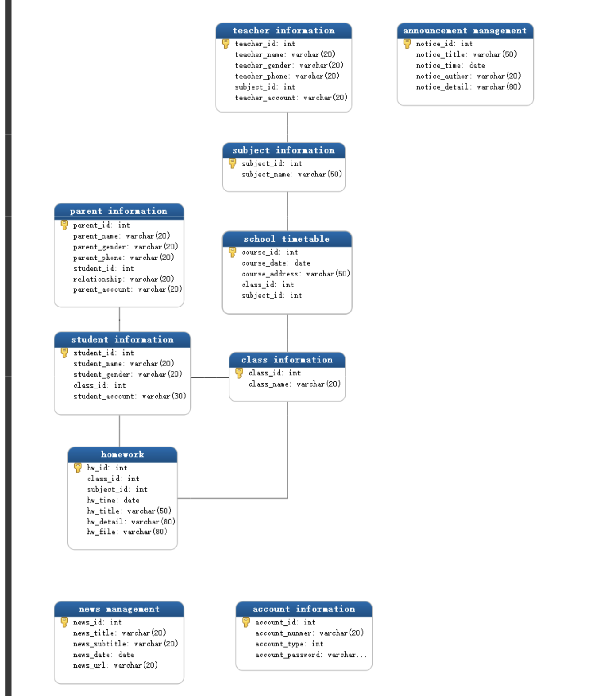

登录入口：

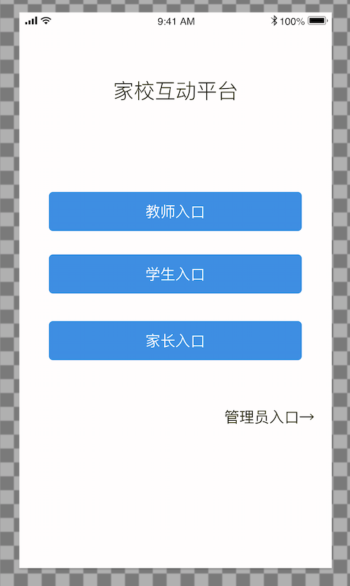

## 【管理员】

登录界面其实四个角色都一样。只不过管理员就一个账号，假设账号密码都为admin。

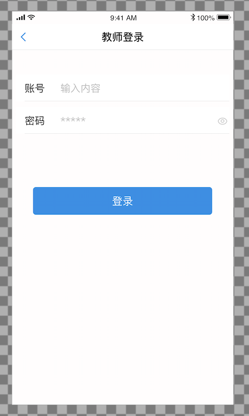

因为是一个App 4个角色用，登录肯定复用同一个。所以在登录时要存储登录的角色。并且为了简化，没有token，也没有过期，校验成功即可，最多保存id和角色，知道当前用户是谁就行。

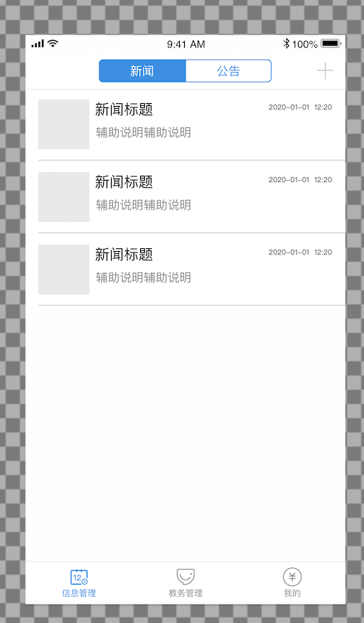

每个角色登录成功后都有三个tab，分别为“信息管理”、“教务管理”、“我的”。虎哥你可以搞个配置文件，到时候我们修改起来方便，切图随便搞一个占位就可以。

第一个“信息管理”是每个角色都有的，但只有管理员右上角有添加入口。添加页码如下：

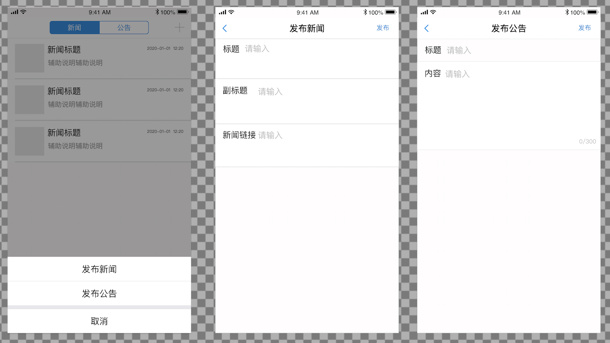

管理员的第二个标签如下：

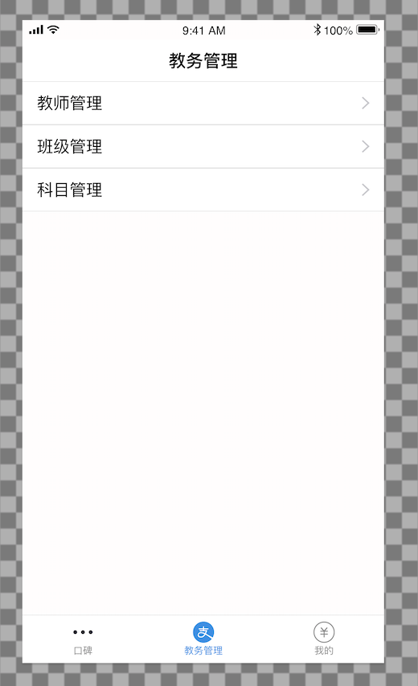

其中教师管理：

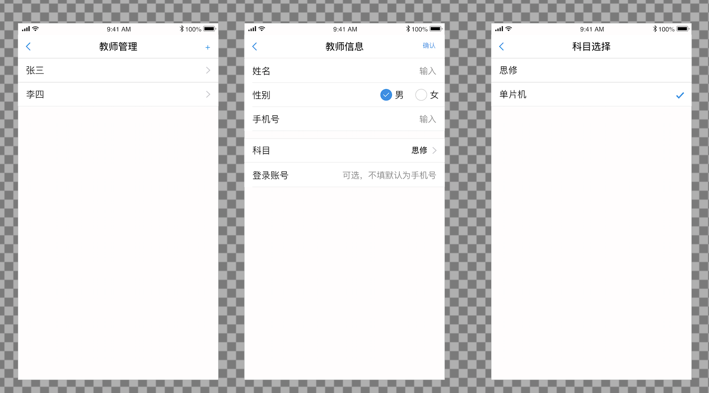

班级管理：

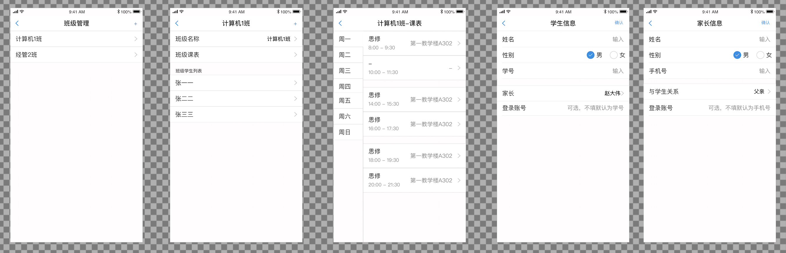

科目管理：

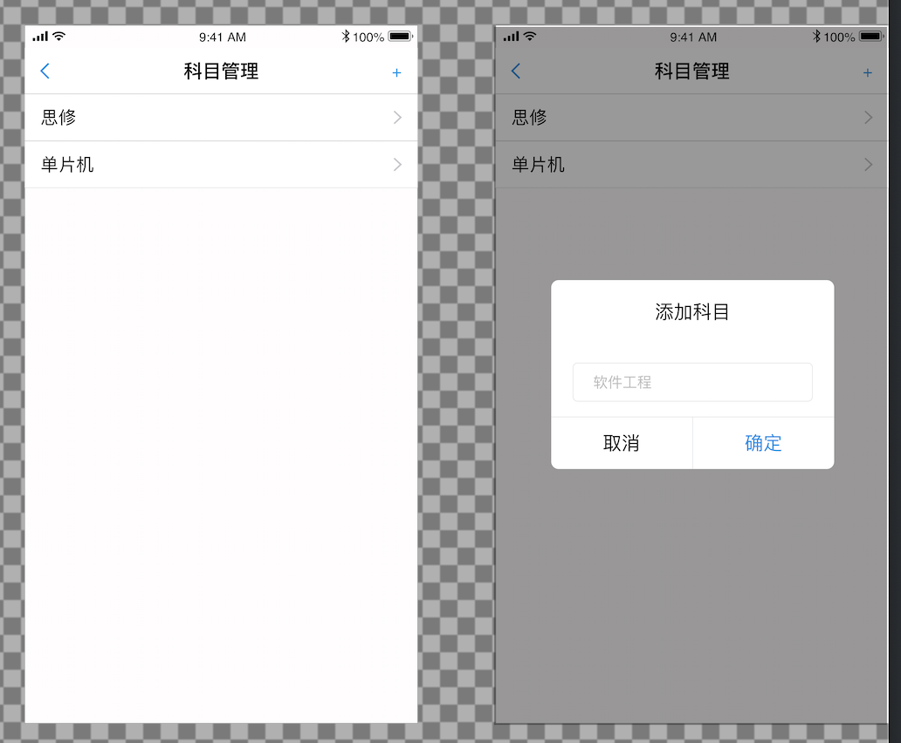

这些都包含了角色的创建。

管理员最后一个tab“我的”，其实4个角色都差不多，就简单展示一些信息即可：

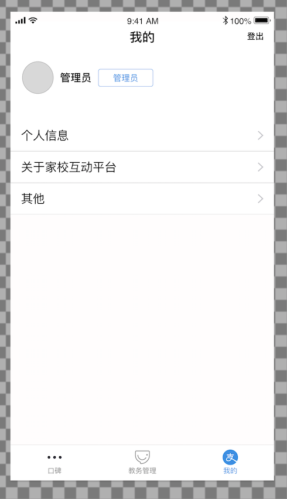

## 【教师】

除了管理员，教师、学生、家长登录时候都还有一个注册的功能，例如当管理员添加了教师账号A，表示A可以注册登录，因为A在教师表有记录，会先用A的信息去用户表查有没有账号密码，如果没有表示没注册，跳到注册页面。注册成功后，用户表有记录了，才可以登录。学生、家长亦是如此。

第一个tab和管理员一样，只是没有添加入口。来看第二个入口：

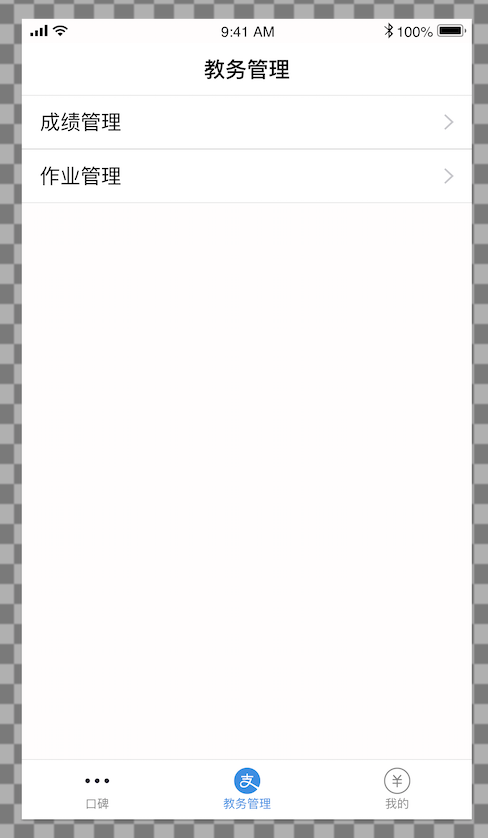

成绩管理包括：

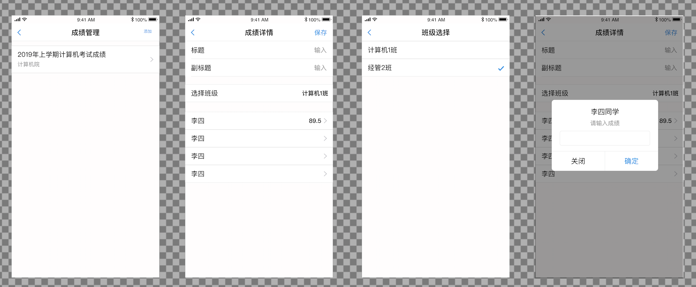

作业管理包括：

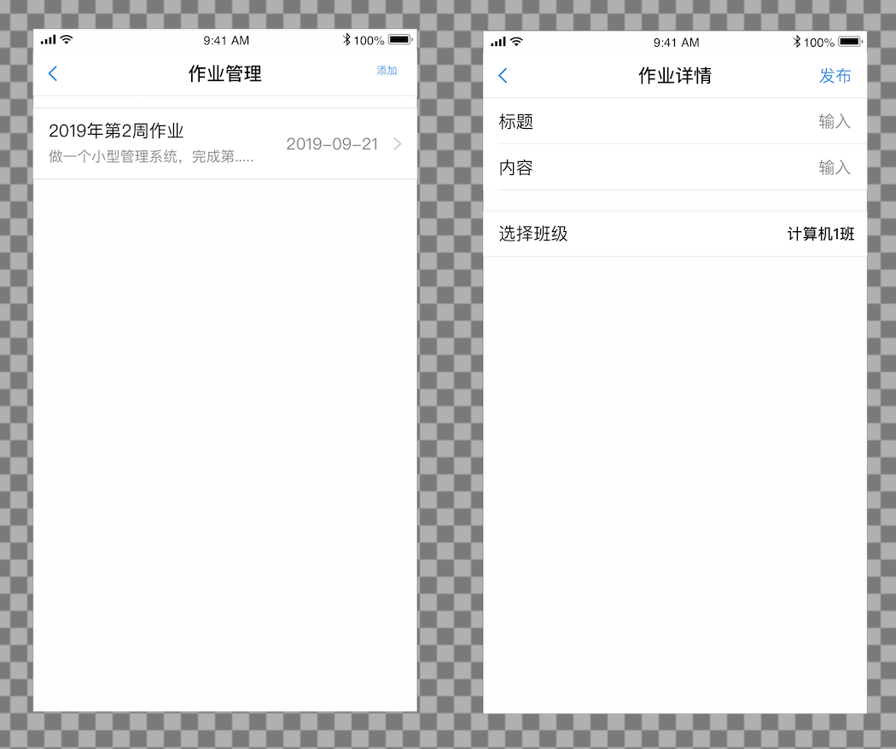

## 【学生】

还是看第二个tab：

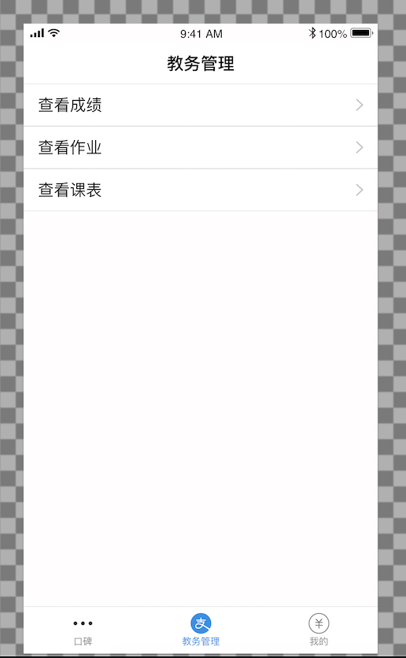

分别为：

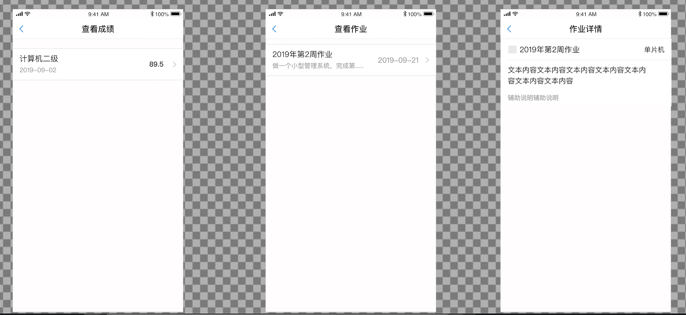

课表的页面，前面有过，复用即可。

## 【家长】

**暂缺，后补**